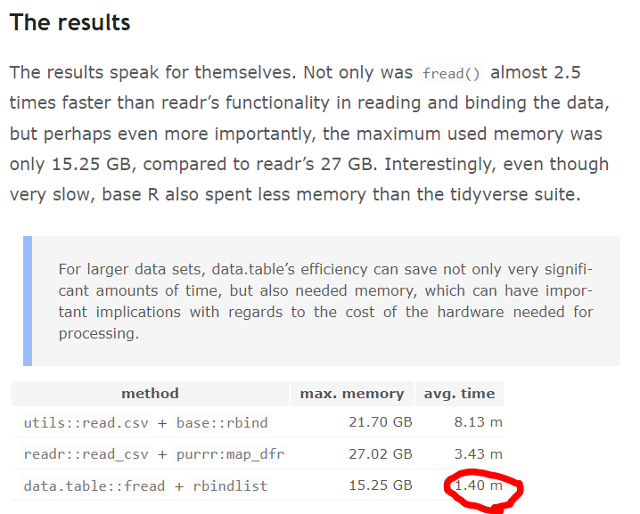
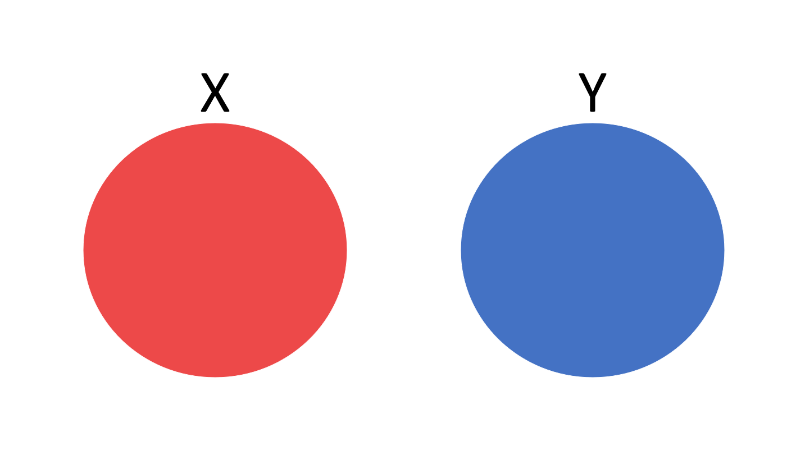
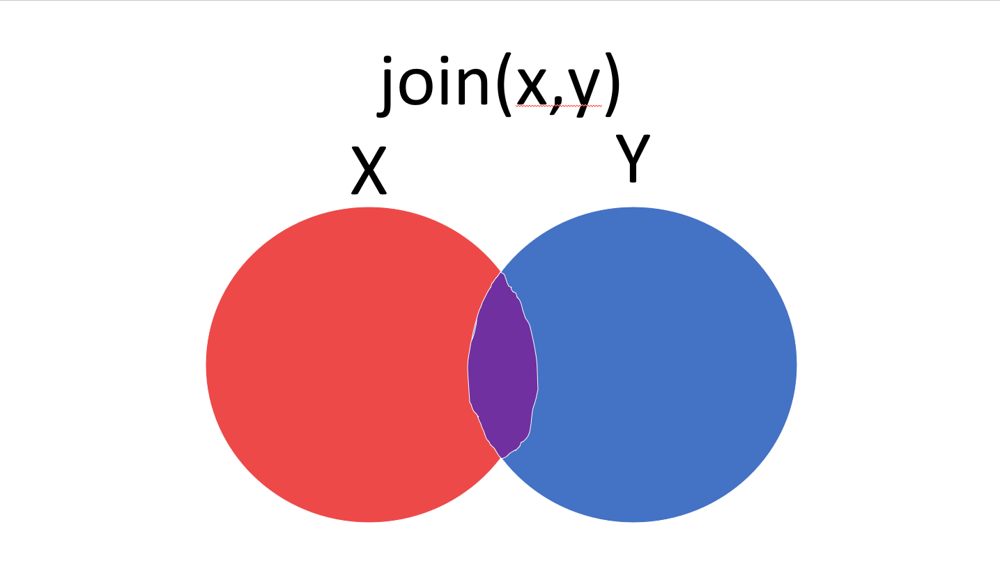
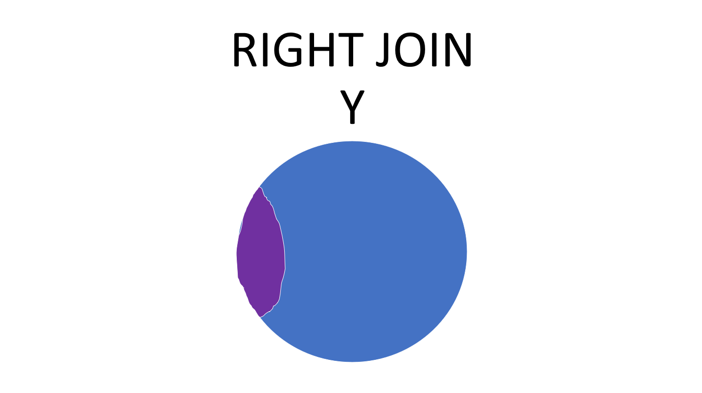
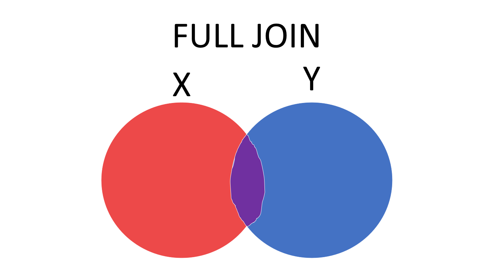
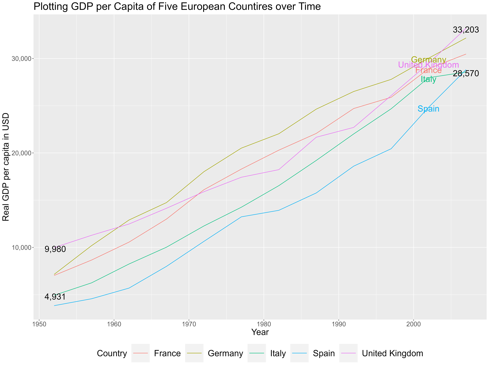
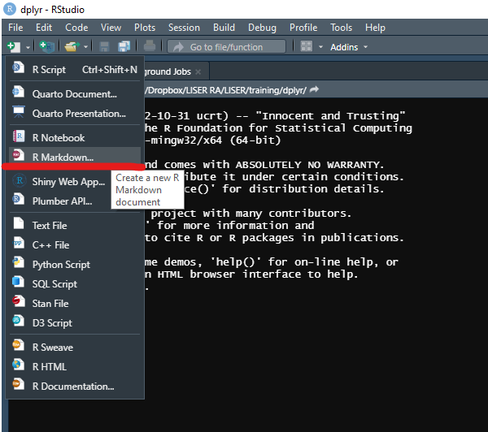

<!-- Print to PDF -->

<!-- Follow this: https://quarto.org/docs/presentations/revealjs/presenting.html#print-to-pdf -->

<!-- Use chrome and not firefox -->

# Introduction

<br>

::: {.callout-important icon="false" appearance="simple"}
This training aims to teach you data analysis in R from A-Z.
:::

Data analysis includes

::: increment
-   reading in a data set

-   cleaning data / manipulating values in columns

-   creating new columns

-   merging data

-   statistical analysis

-   graphing results

-   writing reports
:::

<!-- https://talks.andrewheiss.com/2022-seacen/presentation/#/general-principles -->

## Let's clean up the R environment!

<br>

Let's set the environment for our R-coding.

<br>


::: {.cell}

```{.r .cell-code}
# Clear plots
if(!is.null(dev.list())) dev.off()
# Clear console
cat("\014") 
# Clean workspace
rm(list=ls())

"OR the best way for R studio users"
#restart R
rstudioapi::restartSession()
```
:::


## Calling packages

<br>

Intuitive way

<br>


::: {.cell}

```{.r .cell-code}
library(dplyr)
library(ggplot2)
library(stringr)
library(stringi)
```
:::


## Calling packages

<br>

Easy way

<br>


::: {.cell}

```{.r .cell-code}
packages <- c("dplyr", "ggplot2", "stringr", "stringi")
lapply(packages, require, character.only=T)
```
:::


## Checking the description of the function

<br>

1.  You can type this in console


::: {.cell}

```{.r .cell-code}
?lapply
```
:::


<br>

2.  highlight the function and press f1

<br>

3.  or manual type the function name in the search bar of the Help panel, that is located on the bottom right.

## Setting working directory

<br>


::: {.cell}

```{.r .cell-code}
#checking your current working directory
getwd()

#setting your working directory
setwd("Here_you_type_the_directory_path")
```
:::


# Project

## Project

<br>

The better way to do data analysis with R is by creating a project!!

<br>

Project allows you:

::: incremental
-   to keep the R studio interface as it was before you closed it
-   not to type in the working directory every time
-   to manage your files more easily
:::

## Let's try it out

<br>

Let's create a "training" project at our desktop.

<br>

Follow the section 6 of this [webpage.](https://bookdown.org/daniel_dauber_io/r4np_book/starting-your-r-projects.html)

# Reading in Data

## CSV - basic

<br>


::: {.cell}

```{.r .cell-code}
# Clear plots
if(!is.null(dev.list())) dev.off()
# Clear console
cat("\014") 
# Clean workspace
rm(list=ls())
#reading in packages
packages <- c("dplyr", "ggplot2", "stringr", "stringi")
lapply(packages, require, character.only=T)

#basic way
?read.csv
#let's assume gapminder.csv file is stored in the data folder
## decimal points = "."
data <- read.csv("data/gapminder.csv")
## decimal points = ","
data <- read.csv2("data/gapminder.csv")
```
:::


## CSV - data.table

<br>

It is fast!([link](https://jozef.io/r917-fread-comparisons/))

<br>

{width="100%"}

## CSV - data.table

<br>


::: {.cell}

```{.r .cell-code}
#data table way
install.packages("data.table")
library(data.table)

##install.packages("data.table")
data <- fread("data/gapminder.csv")

#advantages of fread
data <- data.table::fread("data/gapminder.csv",
                          encoding = "UTF-8", #choose encoding 
                          nrows = 10, #choose how many rows
                          select = c("country", "continent")) #choose which columns
```
:::


## STATA, SAS, and SPSS

<br>


::: {.cell}

```{.r .cell-code}
#we need haven package!
install.packages("haven")
library(haven)

#STATA
data <- read_dta("stata.dta")
#SAS
data <- read_sas("sas.sas")
#SPSS
data <- read_spss("spss.spss")
```
:::


## other tables(tab delimited and etc.)

<br>

In general, Google/Stack Overflow is your friend.

<br>


::: {.cell}

```{.r .cell-code}
?read.table

#tab delimited
data <- read.table(file = "data_file_path", 
                   header = T, #if header exists
                   sep = "\t", #tab
                   dec = ",") #using a comma for decimal points

#read.csv
read.table(file = "data/gapminder.csv",
           header = T,
           sep = ",",
           dec = ".")
```
:::


## Calculating time to read a data file

<br>

Many times researchers would like to know how long it takes to read a file.

Especially if the file is large.

<br>


::: {.cell}

```{.r .cell-code}
ct <- Sys.time()
data <- read.csv2("data/gapminder.csv")
print(Sys.time()-ct)
"Time difference of 0.01645303 secs"
```
:::


# Checking/Cleaning the data

## Checking the data

<br>

There are two ways to check/see your data

<br>

::: incremental
-   pressing the variable(in our case "data") button on your right-top panel
-   or typing the variable name in the console
-   type *str(data)*
:::

## Checking the data

<br>

For instance,

<br>


::: {.cell}

```{.r .cell-code}
data <- gapminder::gapminder
str(data)
"tibble [1,704 × 6] (S3: tbl_df/tbl/data.frame)
 $ country  : Factor w/ 142 levels "Afghanistan",..: 1 1 1 1 1 1 1 1 1 1 ...
 $ continent: Factor w/ 5 levels "Africa","Americas",..: 3 3 3 3 3 3 3 3 3 3 ...
 $ year     : int [1:1704] 1952 1957 1962 1967 1972 1977 1982 1987 1992 1997 ...
 $ lifeExp  : num [1:1704] 28.8 30.3 32 34 36.1 ...
 $ pop      : int [1:1704] 8425333 9240934 10267083 11537966 13079460 14880372 12881816 13867957 16317921 22227415 ...
 $ gdpPercap: num [1:1704] 779 821 853 836 740 ..."
```
:::


## first and the last of the data

<br>

Maybe you simply want to check the top N rows or the last N rows

<br>


::: {.cell}

```{.r .cell-code}
#checking the first 6 rows
head(data)
#checking the last 6 rows
tail(data)

#checking the first 10 rows
head(data, 10)
#checking the last 10 rows
tail(data, 10)
```
:::


## Checking unique values

<br>

Maybe you simply want to check unique values of a column

<br>


::: {.cell}

```{.r .cell-code}
#checking unique values of the continent column
unique(data$continent)
"[1] Asia     Europe   Africa   Americas Oceania 
 Levels: Africa Americas Asia Europe Oceania"
```
:::


## Checking variable type

<br>


::: {.cell}

```{.r .cell-code}
typeof(data$continent)
'[1] "integer"'
class(data$continent)
'[1] "factor"' #ordered categorical variable

#comparing factor with character
print(c("a", "b", "c"))
"a" "b" "c"
print(as.factor(c("a", "b", "c")))
"[1] a b c
 Levels: a b c"
```
:::


## Changing variable types

<br>


::: {.cell}

```{.r .cell-code}
#changing variable types
data$continent[1]
"[1] Asia
 Levels: Africa Americas Asia Europe Oceania"
#character
as.character(data$continent[1])
"Asia"
#integer
as.integer(data$continent[1])
"3"
# as.numeric()
# as.factor()
# as.data.frame()
```
:::


## list and vectors

<br>


::: {.cell}

```{.r .cell-code}
#vector can only have one data type!
c(1,2,3)
"[1] 1 2 3"
c(1,"a")
'[1] "1" "a"'

#list can have different data types and name them!
temp <- list("a", 1)
temp
'[[1]]
[1] "a"

[[2]]
[1] 1'
```
:::


## list and vectors


::: {.cell}

```{.r .cell-code}
# to change the list into a vector again
temp <- unlist(temp)
temp
'[1] "a" "1"'

#list can have sub-structures
temp <- list(country = c("France", "Germany"),
             capital = c("Paris", "Berlin"),
             population = c(67500000, 83130000))
'$country
[1] "France"  "Germany"

$capital
[1] "Paris"  "Berlin"

$population
[1] 67500000 83130000'
```
:::


## list and vectors {auto-animate="true"}

<br>

You should be careful when you want to extract a value from a list


::: {.cell}

```{.r .cell-code}
#list
temp[1]
'$country
[1] "France"  "Germany"'
class(temp[1])
'[1] "list"'

#vector
temp[[1]]
#or
temp$country #think $ a sign to use to access a sub-structure(sub-list)
'[1] "France"  "Germany"'
class(temp[[1]])
'[1] "character"'
```
:::


## list and vectors {auto-animate="true"}

<br>

You should be careful when you want to extract a value from a list
```{.r code-line-numbers="13-21"}
#list
temp[1]
'$country
[1] "France"  "Germany"'
class(temp[1])
'[1] "list"'

#vector
temp[[1]]
#or
temp$country #think $ a sign to use to access a sub-structure(sub-list)
'[1] "France"  "Germany"'
class(temp[[1]])
'[1] "character"'

#trying to access a value of a sub-list(country)
temp[1][1] #wrong
'$country
[1] "France"  "Germany"' #retrieved the whole sub-list(country) instead
temp[[1]][1] #right
#or
temp$country[1]
'[1] "France"'
```

## Cleaning missing values

<br>

First, let's create an example data.frame(table in R)

<br>


::: {.cell}

```{.r .cell-code}
df <- data.frame(country = c("France", "Germany", "Luxembourg"),
             capital = c("Paris", "Berlin", NA),
             population = c(67500000, 83130000, 639000))
df
```
:::


## Cleaning missing values

<br>

Piping!

**%\>%**

<br> A special operator from the dplyr package!

Think it as "then" in English.

<br>


::: {.cell}

```{.r .cell-code}
df %>% # call df
  filter(!is.na(capital))
#then filter observations that do not have a missing value(NA) in the capital column
# ! means NOT e.g. 1==1 1!=2

#the equivalent is
filter(df, !is.na(capital))
```
:::


## Cleaning missing values

The advantage of piping is that it allows you to write concise codes. 
For instance, 

<br>


::: {.cell}

```{.r .cell-code}
#basic way
lux <- filter(df, country=="Luxembourg") #getting Luxembourg observation
lux <- mutate(lux, capital = "Luxembourg City") #changing the capital value for Luxembourg
lux
"    country         capital population
1 Luxembourg Luxembourg City     639000"
#piping!
lux <- df %>%
  filter(country=="Luxembourg") %>%
  mutate(capital = "Luxembourg City")
lux
"    country         capital population
1 Luxembourg Luxembourg City     639000"
```
:::


## Cleaning missing values

<br>

Let's say you have odd values for missing values e.g. -999

<br>


::: {.cell}

```{.r .cell-code}
df <- data.frame(country = c("France", "Germany", "Luxembourg"),
             capital = c("Paris", "Berlin", -999),
             population = c(67500000, 83130000, "Non_existent"))
#retrieving luxembourg in two different ways
##1
df %>% 
  filter(capital==-999)
##2
df %>% 
  filter(population=="Non_existent")
```
:::


## Cleaning missing values

<br>


::: {.cell}

```{.r .cell-code}
#retrieve an observation that has the value "-999" in the capital columns
df %>% 
  filter(capital=="-999")
#change the capital value 
df %>% 
  filter(capital=="-999") %>%
  mutate(capital="Luxembourg City")
#change the population value 
df %>% 
  filter(capital=="-999") %>%
  mutate(capital="Luxembourg City") %>%
  mutate(population = 639000)
#different version
df %>% 
  filter(capital=="-999") %>%
  mutate(capital="Luxembourg City",
         population = 639000)
```
:::


## Cleaning missing values

<br>

Don't forget to assign the changed values to the original data frame!

<br>


::: {.cell}

```{.r .cell-code}
df <- df %>% 
  filter(capital=="-999") %>%
  mutate(capital="Luxembourg City",
         population = 639000)
df
"     country         capital population
1  Luxembourg Luxembourg City     639000"
#I WANTED TO CHANGE THE VALUES AND STORE THEM!
#I DON'T WANT TO ONLY GET CLEAN LUX ROW!
```
:::


## Cleaning missing values

<br>

Actually you need to use ifelse() function to get all observations

<br>


::: {.cell}

```{.r .cell-code}
#re-creating the data frame
df <- data.frame(country = c("France", "Germany", "Luxembourg"),
             capital = c("Paris", "Berlin", -999),
             population = c(67500000, 83130000, "Non_existent"))
#changing the capital values!
df %>% 
  mutate(capital=ifelse(capital=="-999", #condition!
                        "Lux City", #if TRUE
                        "FALSE")) #if FALSE
"    country  capital   population
1     France    FALSE     67500000
2    Germany    FALSE     83130000
3 Luxembourg Lux City Non_existent"
```
:::


## Cleaning missing values

<br>

Actually you need to use ifelse() function to get all observations

<br>


::: {.cell}

```{.r .cell-code}
#keeping the other values
df <- df %>% 
  mutate(capital=ifelse(capital=="-999",
                        "Luxembourg City",
                        capital)) #keeping the rest values
#changing the population as well
df <- df %>% 
  mutate(population=ifelse(population=="Non_existent",
                        639000,
                        population)) %>%
  mutate(population = as.integer(population))

df
"    country         capital population
1     France           Paris   67500000
2    Germany          Berlin   83130000
3 Luxembourg Luxembourg City     639000"
```
:::


## Custom function

<br>

Sometimes, you need to create your custom function to detect missing values.

For instance,

<br>


::: {.cell}

```{.r .cell-code}
check_miss <- function(column, bool=F){
  if(bool==F){#if one don't want T/F values for the result
    fin_value <- is.na(column) | stringi::stri_isempty(column)
    fin_value <- grep(T, fin_value) #returning the location where T is located
    return(fin_value)
  }else{
    fin_value <- is.na(column) | stringi::stri_isempty(column) #returning a boolean vector
    return(fin_value)
  }
}
```
:::


## Custom function

<br>

Let's test the function

<br>


::: {.cell}

```{.r .cell-code}
check_miss(c(NA, "Luxembourg" ,""))
"[1] 1 3"

check_miss(c(NA, "Luxembourg" ,""), bool = T)
"[1]  TRUE FALSE  TRUE"
```
:::


# Creating/deleting columns

## Creating columns

<br>

It is simple! Just use mutate() function to create a new column

<br>


::: {.cell}

```{.r .cell-code}
df <- df %>%
  mutate(total_pop = sum(population))
df
"     country         capital population total_pop
1     France           Paris   67500000 151269000
2    Germany          Berlin   83130000 151269000
3 Luxembourg Luxembourg City     639000 151269000"
```
:::


## Creating columns based on condition

<br>

There are two ways!

1.The intuitive way


::: {.cell}

```{.r .cell-code}
#saving the value
temp_pop <- df %>%
  filter(country %in% c("France", "Luxembourg")) %>%
  summarize(french_pop = sum(population)) %>%
  unlist()
temp_pop
"french_pop 
  68139000"
#and then creating the column
df <- df %>%
  mutate(french_pop = temp_pop)
df
"     country         capital population total_pop french_pop
1     France           Paris   67500000 151269000   68139000
2    Germany          Berlin   83130000 151269000   68139000
3 Luxembourg Luxembourg City     639000 151269000   68139000"
```
:::


## Creating columns based on condition 

<br>

2.The complex way


::: {.cell}

```{.r .cell-code}
df <- df %>%
  #creating a column that indicates whether a country speaks french
  mutate(french = ifelse(country %in% c("France", "Luxembourg"),
                             T,
                             F)) %>%
  #grouping by french column
  group_by(french) %>%
  #creating a new column
  mutate(french_pop = ifelse(french==T,
                             sum(population),
                             NA)) %>%
  ungroup() #important!
df
" country    capital         population total_pop french_pop french
  <chr>      <chr>                <int>     <int>      <int> <lgl> 
1 France     Paris             67500000 151269000   68139000 TRUE  
2 Germany    Berlin            83130000 151269000         NA FALSE 
3 Luxembourg Luxembourg City     639000 151269000   68139000 TRUE "
```
:::


## Creating columns based on condition {auto-animate="true"}

<br>

If you forget to ungroup...


::: {.cell}

```{.r .cell-code}
df <- df %>%
  mutate(french = ifelse(country %in% c("France", "Luxembourg"),
                             T,
                             F)) %>%
  group_by(french) %>%
  mutate(french_pop = ifelse(french==T,
                             sum(population),
                             NA))
#results in grouped sum by french still!
df %>%
  mutate(temp = sum(population))
"country    capital         population total_pop french_pop french     temp
  <chr>      <chr>                <int>     <int>      <int> <lgl>     <int>
1 France     Paris             67500000 151269000   68139000 TRUE   68139000
2 Germany    Berlin            83130000 151269000         NA FALSE  83130000
3 Luxembourg Luxembourg City     639000 151269000   68139000 TRUE   68139000"
```
:::


## Creating columns based on condition {auto-animate="true"}

<br>

If you forget to ungroup...

```{.r code-line-numbers="17-19"}
df <- df %>%
  mutate(french = ifelse(country %in% c("France", "Luxembourg"),
                             T,
                             F)) %>%
  group_by(french) %>%
  mutate(french_pop = ifelse(french==T,
                             sum(population),
                             NA))
#results in grouped sum by french still!
df %>%
  mutate(temp = sum(population))
"country    capital         population total_pop french_pop french     temp
  <chr>      <chr>                <int>     <int>      <int> <lgl>     <int>
1 France     Paris             67500000 151269000   68139000 TRUE   68139000
2 Germany    Berlin            83130000 151269000         NA FALSE  83130000
3 Luxembourg Luxembourg City     639000 151269000   68139000 TRUE   68139000"
#check it
is.grouped_df(df)
"[1] TRUE"
```

## Deleting columns

<br>


::: {.cell}

```{.r .cell-code}
#choose the columns you want to exclude
df %>%
  select(-french_pop, -french)
"# A tibble: 3 × 3
  country    capital         population
  <chr>      <chr>                <int>
1 France     Paris             67500000
2 Germany    Berlin            83130000
3 Luxembourg Luxembourg City     639000"
#choose the columns you only need
df %>%
  select(country, capital, population, total_pop)
"# A tibble: 3 × 4
  country    capital         population total_pop
  <chr>      <chr>                <int>     <int>
1 France     Paris             67500000 151269000
2 Germany    Berlin            83130000 151269000
3 Luxembourg Luxembourg City     639000 151269000"
```
:::


## Deleting columns {auto-animate="true"}

```{.r code-line-numbers="19-28"}
#choose the columns you want to exclude
df %>%
  select(-french_pop, -french)
"# A tibble: 3 × 3
  country    capital         population
  <chr>      <chr>                <int>
1 France     Paris             67500000
2 Germany    Berlin            83130000
3 Luxembourg Luxembourg City     639000"
#choose the columns you only need
df %>%
  select(country, capital, population, total_pop)
"# A tibble: 3 × 4
  country    capital         population total_pop
  <chr>      <chr>                <int>     <int>
1 France     Paris             67500000 151269000
2 Germany    Berlin            83130000 151269000
3 Luxembourg Luxembourg City     639000 151269000"
#declare the columns of interest first!
cols <- c("country", "capital", "population", "total_pop")
df %>%
  select(all_of(cols)) #there is also any_of()
"# A tibble: 3 × 4
  country    capital         population total_pop
  <chr>      <chr>                <int>     <int>
1 France     Paris             67500000 151269000
2 Germany    Berlin            83130000 151269000
3 Luxembourg Luxembourg City     639000 151269000"
```

## Deleting columns {auto-animate="true"}

<br>

Let's try an advanced example!


::: {.cell}

```{.r .cell-code}
#advanced
df <- data.frame(country = "France",
                 capital = "Pairs",
                 population = 67500000, 
                 Y1950_population = NA,
                 Y1960_population = "",
                 Y1970_population = -999)
df
```
:::


## Deleting columns {auto-animate="true"}

<br>

Find columns that you want to erase!

``` {.r code-line-numbers="9-15"}
#advanced
df <- data.frame(country = "France",
                 capital = "Pairs",
                 population = 67500000, 
                 Y1950_population = NA,
                 Y1960_population = "",
                 Y1970_population = -999)
df

#check the column names of df
colnames(df)

#find the columns you want to delete!
grep("^Y", colnames(df))
grepl("^Y", colnames(df))
```

## Deleting columns {auto-animate="true"}

<br>

Declare the columns you want to erase!

``` {.r code-line-numbers="16-20"}
#advanced
df <- data.frame(country = "France",
                 capital = "Pairs",
                 population = 67500000, 
                 Y1950_population = NA,
                 Y1960_population = "",
                 Y1970_population = -999)
df

#check the column names of df
colnames(df)

#find the columns you want to delete!
grep("^Y", colnames(df))
grepl("^Y", colnames(df))

#declare the columns you want to erase!
del_cols <- colnames(df)[grep("^Y", colnames(df))]
del_cols
'Y1950_population" "Y1960_population" "Y1970_population"'
```

## Deleting columns {auto-animate="true"}

<br>

Remove the columns from the data frame!

``` {.r code-line-numbers="21-27"}
#advanced
df <- data.frame(country = "France",
                 capital = "Pairs",
                 population = 67500000, 
                 Y1950_population = NA,
                 Y1960_population = "",
                 Y1970_population = -999)
df

#check the column names of df
colnames(df)

#find the columns you want to delete!
grep("^Y", colnames(df))
grepl("^Y", colnames(df))

#declare the columns you want to erase!
del_cols <- colnames(df)[grep("^Y", colnames(df))]
del_cols
'"Y1950_population" "Y1960_population" "Y1970_population"'

#exclude the columns!
df <- df %>%
  select(-all_of(del_cols))
df
"  country capital population
1  France   Pairs   67500000"
```

## Deleting columns

<br>

-   For more information on string matching based on regular expression, please check this [website.](https://r4ds.had.co.nz/strings.html#matching-patterns-with-regular-expressions)

# Merging data

## Different joins

In R programming, people often use the term 'join' for merging the data, and many different types of join exist.

1.  left join
2.  right join
3.  inner join
4.  full join

## Data

<br>

Let's say we have two data sets: X and Y. <br> {width="60%"}

## join

<br>

We would like the merge the two. <br> Think the **colored area** as **observations**! {width="60%"}

## inner join

[Animation](https://github.com/gadenbuie/tidyexplain#inner-join)

<br>

{width="60%"}

## left join

[Animation](https://github.com/gadenbuie/tidyexplain#left-join)

<br>

{width="60%"}

## right join

[Animation](https://github.com/gadenbuie/tidyexplain#right-join)

<br>

{width="60%"}

## full join

[Animation](https://github.com/gadenbuie/tidyexplain#full-join)

<br>

{width="60%"}

## etc.

Help page is accessible by typing


::: {.cell}

```{.r .cell-code}
?left_join
```
:::


it shows simple explanation of each join.

<br>

For different joins and animation visit [this github page](https://github.com/gadenbuie/tidyexplain)

## Example


::: {.cell}

```{.r .cell-code}
#setting the data sets
x.df <- data.frame(id = c(1,2),
                   country = c("France", "Germany"),
                   capital = c("Paris", "Berlin"),
                   population = c(67500000, 83130000))

y.df <- data.frame(id = c(2,3),
                   country = c("Germany", "Luxembourg"),
                   capital = c( "Berlin", "Luxembourg City"),
                   language = c( "DE",  "FR"))
```
:::


## left_join example


::: {.cell}

```{.r .cell-code}
merged.df <- left_join(x = x.df, 
                       y = y.df,
                       by = "id") #by which column will you merge
merged.df
" id country.x capital.x population country.y capital.y language
1  1    France     Paris   67500000      <NA>      <NA>     <NA>
2  2   Germany    Berlin   83130000   Germany    Berlin       DE"
```
:::


## right_join example


::: {.cell}

```{.r .cell-code}
merged.df <- right_join(x = x.df, 
                        y = y.df,
                        by = "id") #by which column will you merge
merged.df
" id country.x capital.x population  country.y       capital.y language
1  2   Germany    Berlin   83130000    Germany          Berlin       DE
2  3      <NA>      <NA>         NA Luxembourg Luxembourg City       FR"
```
:::


## inner_join example


::: {.cell}

```{.r .cell-code}
merged.df <- inner_join(x = x.df, 
                        y = y.df,
                        by = "id") #by which column will you merge
merged.df
" id country.x capital.x population country.y capital.y language
1  2   Germany    Berlin   83130000   Germany    Berlin       DE"
```
:::


## full_join example


::: {.cell}

```{.r .cell-code}
merged.df <- full_join(x = x.df, 
                       y = y.df,
                       by = "id") #by which column will you merge
merged.df
"id country.x capital.x population  country.y       capital.y language
1  1    France     Paris   67500000       <NA>            <NA>     <NA>
2  2   Germany    Berlin   83130000    Germany          Berlin       DE
3  3      <NA>      <NA>         NA Luxembourg Luxembourg City       FR"
```
:::


## advanced merge {auto-animate="true"}

<br>

You can change the suffix setting if ".x" & ".y" does not help you have a full picture of the merging process

<br>


::: {.cell}

```{.r .cell-code}
merged.df <- left_join(x = x.df, 
                       y = y.df,
                       by = "id", #by which column will you merge
                       suffix = c(".population", ".language"))
merged.df
"id country.population capital.population population country.language capital.language language
1  1             France              Paris   67500000             <NA>             <NA>     <NA>
2  2            Germany             Berlin   83130000          Germany           Berlin       DE"
```
:::


## advanced merge {auto-animate="true"}

<br>

Let's remove redundant columns

<br>

``` {.r code-line-numbers="6-17"}
merged.df <- left_join(x = x.df, 
                       y = y.df,
                       by = "id", #by which column will you merge
                       suffix = c(".population", ".language"))
merged.df

#delete redundant columns
##retrieving column names that has ".language"
grepl(".language", colnames(merged.df)) 
del_cols <- colnames(merged.df)[grepl(".language", colnames(merged.df))]
##remove!
merged.df <- merged.df %>%
  select(-all_of(del_cols))
merged.df
"id country.population capital.population population language
1  1             France              Paris   67500000     <NA>
2  2            Germany             Berlin   83130000       DE"
```

## advanced merge {auto-animate="true"}

<br>

Let's rename the columns and fill in the blank language cell!

<br>

``` {.r code-line-numbers="18-32"}
merged.df <- left_join(x = x.df, 
                       y = y.df,
                       by = "id", #by which column will you merge
                       suffix = c(".population", ".language"))
merged.df

#delete redundant columns
##retrieving column names that has ".language"
grepl(".language", colnames(merged.df)) 
del_cols <- colnames(merged.df)[grepl(".language", colnames(merged.df))]
##remove!
merged.df <- merged.df %>%
  select(-all_of(del_cols))
merged.df
"id country.population capital.population population language
1  1             France              Paris   67500000     <NA>
2  2            Germany             Berlin   83130000       DE"

#rename column names
##declaring the column names you want to have
col_names <- gsub(".population", "", colnames(merged.df)) #removing all the ".population" part
colnames(merged.df) <- col_names

#filling in the language column for France
merged.df <- merged.df %>%
  mutate(language = ifelse(country=="France",
                           "FR",
                           language))
merged.df
"  id country capital population language
1  1  France   Paris   67500000       FR
2  2 Germany  Berlin   83130000       DE"
```

# Simple statistical analysis

------------------------------------------------------------------------

## Checking average of a variable

<br>

Let's read in a gapminder data set

<br>


::: {.cell}

```{.r .cell-code}
#install the package
install.packages("gapminder")
library(gapminder)
#reading in the data
data <- gapminder
data
```
:::


## Checking average of a variable

<br>

Simple version

<br>


::: {.cell}

```{.r .cell-code}
summary(data$lifeExp)
" Min. 1st Qu.  Median    Mean 3rd Qu.    Max. 
  23.60   48.20   60.71   59.47   70.85   82.60 "
```
:::


## Checking average of a variable

<br>

Calculating the average of Europe

<br>


::: {.cell}

```{.r .cell-code}
data %>%
  filter(continent=="Europe") %>%
  summarise(life_avg_eu = mean(lifeExp))
" life_avg_eu
        <dbl>
1        71.9"
```
:::


## Checking average of a variable

<br>

Calculating the average & standard deviation of the life Expectancy by continent

<br>


::: {.cell}

```{.r .cell-code}
data %>%
  group_by(continent) %>%
  summarise(life_avg = mean(lifeExp),
            life_sd = sd(lifeExp))
"# A tibble: 5 × 3
  continent life_avg life_sd
  <fct>        <dbl>   <dbl>
1 Africa        48.9    9.15
2 Americas      64.7    9.35
3 Asia          60.1   11.9 
4 Europe        71.9    5.43
5 Oceania       74.3    3.80"
```
:::


## Checking average of a variable

<br>

If you want to save the resulted table, don't forget to save it!

<br>


::: {.cell}

```{.r .cell-code}
life_sum.df <- data %>%
  group_by(continent) %>%
  summarise(life_avg = mean(lifeExp),
            life_sd = sd(lifeExp))
life_sum.df
"# A tibble: 5 × 3
  continent life_avg life_sd
  <fct>        <dbl>   <dbl>
1 Africa        48.9    9.15
2 Americas      64.7    9.35
3 Asia          60.1   11.9 
4 Europe        71.9    5.43
5 Oceania       74.3    3.80"
```
:::


## Linear regression {auto-animate="true"}

<br>

Simple linear regression

<br>


::: {.cell}

```{.r .cell-code}
#simple linear regression
ols <- lm(formula = lifeExp ~ gdpPercap + continent,
          data = data)
ols
```
:::


## Linear regression {auto-animate="true"}

<br>

Checking the result

```{.r code-line-numbers="5-26"}
#simple linear regression
ols <- lm(formula = lifeExp ~ gdpPercap + continent,
          data = data)
ols
summary(ols)
"Call:
lm(formula = lifeExp ~ gdpPercap + continent, data = data)

Residuals:
    Min      1Q  Median      3Q     Max 
-49.241  -4.479   0.347   5.105  25.138 

Coefficients:
                   Estimate Std. Error t value Pr(>|t|)    
(Intercept)       4.789e+01  3.398e-01  140.93   <2e-16 ***
gdpPercap         4.453e-04  2.350e-05   18.95   <2e-16 ***
continentAmericas 1.359e+01  6.008e-01   22.62   <2e-16 ***
continentAsia     8.658e+00  5.555e-01   15.59   <2e-16 ***
continentEurope   1.757e+01  6.257e-01   28.08   <2e-16 ***
continentOceania  1.815e+01  1.787e+00   10.15   <2e-16 ***
---
Signif. codes:  0 ‘***’ 0.001 ‘**’ 0.01 ‘*’ 0.05 ‘.’ 0.1 ‘ ’ 1

Residual standard error: 8.39 on 1698 degrees of freedom
Multiple R-squared:  0.5793,	Adjusted R-squared:  0.5781 
F-statistic: 467.7 on 5 and 1698 DF,  p-value: < 2.2e-16"
```

## Linear regression

<br>

Checking the regression result in detail


::: {.cell}

```{.r .cell-code}
#ols result!
ols_result <- summary(ols)

#checking the coefficients
ols_result$coefficients
"                      Estimate   Std. Error   t value      Pr(>|t|)
(Intercept)       4.788852e+01 3.398053e-01 140.92927  0.000000e+00
gdpPercap         4.452704e-04 2.349795e-05  18.94933  8.552893e-73
continentAmericas 1.359272e+01 6.007856e-01  22.62491  2.822476e-99
continentAsia     8.657793e+00 5.554859e-01  15.58598  2.719424e-51
continentEurope   1.757234e+01 6.257430e-01  28.08236 7.595526e-143
continentOceania  1.814604e+01 1.787426e+00  10.15205  1.502557e-23"
class(ols_result$coefficients)
'"matrix" "array"'
```
:::

## Linear regression

<br>

Dealing with scientific notations(e)

::: {.cell}

```{.r .cell-code}
#scientific notation
ols_result$coefficients[,1]
"     (Intercept)         gdpPercap continentAmericas     continentAsia 
     4.788852e+01      4.452704e-04      1.359272e+01      8.657793e+00 
  continentEurope  continentOceania 
     1.757234e+01      1.814604e+01"
format(ols_result$coefficients[,1], scientific = F)
'     (Intercept)         gdpPercap continentAmericas     continentAsia 
  "47.8885161789"   " 0.0004452704"   "13.5927218705"   " 8.6577934769" 
  continentEurope  continentOceania 
  "17.5723409668"   "18.1460410154" '
#NOTE THAT the numbers are characters now!
```
:::


## Linear regression {auto-animate="true"}

```{.r code-line-numbers="13-17"}
#scientific notation
ols_result$coefficients[,1]
"(Intercept)         gdpPercap continentAmericas     continentAsia 
     4.788852e+01      4.452704e-04      1.359272e+01      8.657793e+00 
  continentEurope  continentOceania 
     1.757234e+01      1.814604e+01"
format(ols_result$coefficients[,1], scientific = F)
' (Intercept)         gdpPercap continentAmericas     continentAsia 
  "47.8885161789"   " 0.0004452704"   "13.5927218705"   " 8.6577934769" 
  continentEurope  continentOceania 
  "17.5723409668"   "18.1460410154" '
#NOTE THAT the numbers are characters now!

#try round() function
round(ols_result$coefficients[,1],4) #rounding up at the fourth decimal point
'      (Intercept)         gdpPercap continentAmericas     continentAsia   continentEurope  continentOceania 
          47.8885            0.0004           13.5927            8.6578           17.5723           18.1460'
```
## Linear regression 
<br>

For more details of running different regressions, please check this website: [*Intorduction to Econometrics with R*](https://www.econometrics-with-r.org/index.html).

# Plotting graphs

## ggplot

<br>

Now, it is time to plot pretty graphs!

<br>

We will use ggplot2 package for plotting graphs.

<br>

Please check out this [link](https://ggplot2.tidyverse.org/#learning-ggplot2) for more information.

<br>

[Download the ggplot cheat sheet!](https://github.com/rstudio/cheatsheets/raw/main/data-visualization.pdf)

## Our goal

Our goal is to draw a graph like this
{width="75%"}

## basic dot plot

<br>

Let's start with a basic plot


::: {.cell}

```{.r .cell-code}
#reading in data again
data <- gapminder::gapminder

#simple dot graph for Italy
data %>%
  filter(country=="Italy") %>%
  ggplot() + 
  geom_point(aes(x = year, y = gdpPercap))
```
:::


## usual graph types

<br>

::: increment
-   dot plot - geom_point()

-   line graph - geom_line()

-   bar plot - geom_bar(x)

-   bar plot - geom_col(x,y)

-   density graph - geom_density()
:::

## with multiple countries

<br>

Multiple countries!

<br> Impossible to differentiate which point belongs to which country


::: {.cell}

```{.r .cell-code}
#reading in data again
data <- gapminder::gapminder

#simple dot graph for some European countries
data %>%
  filter(country %in% c("United Kingdom", "Germany", "France", "Italy", "Spain")) %>%
  ggplot() + 
  geom_point(aes(x = year, y = gdpPercap))
```
:::


## Adding colors

<br>

Let's add some colors according to a country!


::: {.cell}

```{.r .cell-code}
#simple dot graph for some European countries
data %>%
  filter(country %in% c("United Kingdom", "Germany", "France", "Italy", "Spain")) %>%
  ggplot() + 
  geom_point(aes(x = year, y = gdpPercap, color = country)) #note that it is important to put color = country inside of aes()
```
:::


## Adding colors

<br>

Let's add some colors according to a country!


::: {.cell}

```{.r .cell-code}
#simple bar(column) graph for some European countries
data %>%
  filter(country %in% c("United Kingdom", "Germany", "France", "Italy", "Spain")) %>%
  ggplot() + 
  geom_col(aes(x = year, y = gdpPercap, color = country)) #note that it is important to put color = country inside of aes()

#for bar graphs you should use fill!
data %>%
  filter(country %in% c("United Kingdom", "Germany", "France", "Italy", "Spain")) %>%
  ggplot() + 
  geom_col(aes(x = year, y = gdpPercap, fill = country)) #note that it is important to put color = country inside of aes()
```
:::


## Changing axis labels


::: {.cell}

```{.r .cell-code}
#simple line graph for some European countries
data %>%
  filter(country %in% c("United Kingdom", "Germany", "France", "Italy", "Spain")) %>%
  ggplot() + 
  geom_line(aes(x = year, y = gdpPercap, color = country)) +
  labs(x="Year", y="Real GDP per capita in USD") #changing the axis label
```
:::


## Setting the plot title


::: {.cell}

```{.r .cell-code}
#simple line graph for some European countries
data %>%
  filter(country %in% c("United Kingdom", "Germany", "France", "Italy", "Spain")) %>%
  ggplot() + 
  geom_line(aes(x = year, y = gdpPercap, color = country)) +
  labs(x="Year", y="Real GDP per capita in USD",
       title = "Plotting GDP per Capita of Five European Countires over Time")
```
:::


## Changing legend position


::: {.cell}

```{.r .cell-code}
#simple line graph for some European countries
data %>%
  filter(country %in% c("United Kingdom", "Germany", "France", "Italy", "Spain")) %>%
  ggplot() + 
  geom_line(aes(x = year, y = gdpPercap, color = country)) +
  labs(x="Year", y="Real GDP per capita in USD",
       title = "Plotting GDP per Capita of Five European Countires over Time") + 
  theme(legend.position = "bottom")
```
:::


## Changing title/legend/axis text size


::: {.cell}

```{.r .cell-code}
#simple line graph for some European countries
data %>%
  filter(country %in% c("United Kingdom", "Germany", "France", "Italy", "Spain")) %>%
  ggplot() + 
  geom_line(aes(x = year, y = gdpPercap, color = country)) +
  labs(x="Year", y="Real GDP per capita in USD",
       title = "Plotting GDP per Capita of Five European Countires over Time") + 
  theme(legend.position = "bottom",
        legend.title = element_text(size = 20), #changing legend title size
        legend.text = element_text(size = 20), #changing legend text size
        axis.text.x = element_text(size = 15), #changing axis text size
        axis.title.x = element_text(size = 20), #changing axis title size
        axis.text.y = element_text(size = 15), #changing axis text size
        axis.title.y = element_text(size = 20), #changing axis title size
        title = element_text(size = 20)) #changing title size
```
:::


## Changing legend box size


::: {.cell}

```{.r .cell-code}
#simple line graph for some European countries
data %>%
  filter(country %in% c("United Kingdom", "Germany", "France", "Italy", "Spain")) %>%
  ggplot() + 
  geom_line(aes(x = year, y = gdpPercap, color = country)) +
  labs(x="Year", y="Real GDP per capita in USD",
       title = "Plotting GDP per Capita of Five European Countires over Time") + 
  theme(legend.position = "bottom",
        legend.title = element_text(size = 20), #changing legend title size
        legend.text = element_text(size = 20), #changing legend text size
        axis.text.x = element_text(size = 15), #changing axis text size
        axis.title.x = element_text(size = 20), #changing axis title size
        axis.text.y = element_text(size = 15), #changing axis text size
        axis.title.y = element_text(size = 20),  #changing axis title size
        title = element_text(size = 20), #changing title size
        legend.key.size = unit(1.5, 'cm')) #changing legend color box size
```
:::


## Changing legend title


::: {.cell}

```{.r .cell-code}
#simple line graph for some European countries
base_plot <- data %>%
  filter(country %in% c("United Kingdom", "Germany", "France", "Italy", "Spain")) %>%
  ggplot() + 
  geom_line(aes(x = year, y = gdpPercap, color = country)) +
  labs(x="Year", y="Real GDP per capita in USD",
       title = "Plotting GDP per Capita of Five European Countires over Time") + 
  theme(legend.position = "bottom",
        legend.title = element_text(size = 20), #changing legend title size
        legend.text = element_text(size = 20), #changing legend text size
        axis.text.x = element_text(size = 15), #changing axis text size
        axis.title.x = element_text(size = 20), #changing axis title size
        axis.text.y = element_text(size = 15), #changing axis text size
        axis.title.y = element_text(size = 20),  #changing axis title size
        title = element_text(size = 20), #changing title size
        legend.key.size = unit(1.5, 'cm')) + #changing legend color box size
  scale_color_discrete(name = "Country") #changing legend title
base_plot
```
:::


## Formatting axis tick


::: {.cell}

```{.r .cell-code}
#simple line graph for some European countries
base_plot <- data %>%
  filter(country %in% c("United Kingdom", "Germany", "France", "Italy", "Spain")) %>%
  ggplot() + 
  geom_line(aes(x = year, y = gdpPercap, color = country)) +
  labs(x="Year", y="Real GDP per capita in USD",
       title = "Plotting GDP per Capita of Five European Countires over Time") + 
  theme(legend.position = "bottom",
        legend.title = element_text(size = 20), #changing legend title size
        legend.text = element_text(size = 20), #changing legend text size
        axis.text.x = element_text(size = 15), #changing axis text size
        axis.title.x = element_text(size = 20), #changing axis title size
        axis.text.y = element_text(size = 15), #changing axis text size
        axis.title.y = element_text(size = 20),  #changing axis title size
        title = element_text(size = 20), #changing title size
        legend.key.size = unit(1.5, 'cm')) + #changing legend color box size
  scale_color_discrete(name = "Country") +#changing legend title
  scale_y_continuous(labels= scales::comma) #formatting the y axis tick
base_plot
```
:::


## Adding GDP text labels on the graph {auto-animate="true"}

<br>

First, let's create a separate data frame for the GDP text labels.

<br>


::: {.cell}

```{.r .cell-code}
#print(sort(unique(data$year)))
"[1] 1952 1957 1962 1967 1972 1977 1982 1987 1992 1997 2002 2007"

#creating the GDP text data frame
gdp_text.df <- data %>%
  filter(country %in% c("United Kingdom", "Italy")) %>%
  filter(year==1952 | year==2007)
```
:::


## Adding GDP text labels on the graph {auto-animate="true"}

<br>

Second, let's add another layer!

<br>

``` {.r code-line-numbers="8-13"}
#print(sort(unique(data$year)))
"[1] 1952 1957 1962 1967 1972 1977 1982 1987 1992 1997 2002 2007"

#creating the GDP text data frame
gdp_text.df <- data %>%
  filter(country %in% c("United Kingdom", "Italy")) %>%
  filter(year==1952 | year==2007)

#adding the text layer
final_plot <- base_plot + 
  geom_text(data = gdp_text.df,
            aes(x = year, y = gdpPercap, label = gdpPercap))
final_plot
```

## Adjusting the text size/position


::: {.cell}

```{.r .cell-code}
#print(sort(unique(data$year)))
"[1] 1952 1957 1962 1967 1972 1977 1982 1987 1992 1997 2002 2007"

#creating the GDP text data frame
gdp_text.df <- data %>%
  filter(country %in% c("United Kingdom", "Italy")) %>%
  filter(year==1952 | year==2007)

#adding the text layer
mid_plot <- base_plot + 
  geom_text(data = gdp_text.df,
            aes(x = year, y = gdpPercap, label = gdpPercap),
            size = 7, #size adjustment
            vjust = 0.7) #vertical position adjustment
mid_plot
```
:::


## Formatting the GDP neatly


::: {.cell}

```{.r .cell-code}
#print(sort(unique(data$year)))
"[1] 1952 1957 1962 1967 1972 1977 1982 1987 1992 1997 2002 2007"

#creating the GDP text data frame
gdp_text.df <- data %>%
  filter(country %in% c("United Kingdom", "Italy")) %>%
  filter(year==1952 | year==2007)

#adding the text layer
mid_plot <- base_plot + 
  geom_text(data = gdp_text.df,
            aes(x = year, y = gdpPercap, 
                label = round(gdpPercap)), #rounding up the GDP!
            size = 7, #size adjustment
            vjust = 0.7) #position adjustment
mid_plot
```
:::


## Formatting the GDP neatly


::: {.cell}

```{.r .cell-code}
#print(sort(unique(data$year)))
"[1] 1952 1957 1962 1967 1972 1977 1982 1987 1992 1997 2002 2007"

#creating the GDP text data frame
gdp_text.df <- data %>%
  filter(country %in% c("United Kingdom", "Italy")) %>%
  filter(year==1952 | year==2007)

#adding the text layer
mid_plot <- base_plot + 
  geom_text(data = gdp_text.df,
            aes(x = year, y = gdpPercap, 
                label = format(round(gdpPercap), big.mark = ",", big.interval = 3L)), #rounding up the GDP and adding a comma!!
            size = 7, #size adjustment
            vjust = 0.7) #position adjustment
mid_plot
```
:::


## Adding Country text labels on the graph {auto-animate="true"}

<br>

Let's create a separate data frame for the country text labels.

<br>


::: {.cell}

```{.r .cell-code}
#creating the country text data frame
country_text.df <- data %>%
  filter(country %in% c("United Kingdom", "Germany", "France", "Italy", "Spain"))%>%
  filter(year==2002)
```
:::


## Adding country text labels on the graph {auto-animate="true"}

<br>

Second, let's add another layer!

<br>

``` {.r code-line-numbers="5-13"}
#creating the country text data frame
country_text.df <- data %>%
  filter(country %in% c("United Kingdom", "Germany", "France", "Italy", "Spain"))%>%
  filter(year==2002)

#adding the text layer
final_plot <- mid_plot + 
  geom_text(data = country_text.df,
            aes(x = year, y = gdpPercap, label = country, color = country),
            size = 7,
            vjust = 0.7,
            show.legend = F) #not showing the legend
final_plot
```

## Saving the graph

<br>

Let's save the final_plot

<br>


::: {.cell}

```{.r .cell-code}
#saving the final plot
ggsave(plot = final_plot,
       filename = "img/output.jpg", 
       #make sure you have created an 'img' folder in your project directory
       width = 40,
       height = 30,
       units = "cm")
```
:::


# Writing a report

## R Markdown

<br>

What is an R Markdown?

<br>

-\> Think as a latex file combined with R!

<br>

Check these links:

::: incremental
-   [R Markdown website from Rstudio](https://rmarkdown.rstudio.com/lesson-1.html)
-   [knitr package website](https://yihui.org/knitr/)
-   [R Markdown cheat sheet](https://github.com/rstudio/cheatsheets/raw/main/rmarkdown-2.0.pdf)
:::

## installing knitr package

<br>

knitr package is an essential package for any R Markdown file

<br>

It also allows the user to format tables and graphs neatly. <br>


::: {.cell}

```{.r .cell-code}
#type this in the console
install.packages("knitr")
```
:::


## creating a new R Markdown file

{width="60%"}

## creating a new R Markdown file

{width="60%"}

## choosing the output type(pdf)

<br>

This session only focuses on pdf format.

<br>

If you are more interested in html format, please check out:

<br>

::: incremental
-   [Quarto](https://quarto.org/)
-   [R Shiny](https://shiny.rstudio.com/)
:::

## Setting the yaml header


::: {.cell}

```{.r .cell-code}
---
title: "R markdwon guide"
author: "Jongoh Kim"
date: "`r format(Sys.time(), '%d %B, %Y')`" #setting the date by dd month, yyyy
output: 
  pdf_document:
    toc: true #add a table of contents a the start of a document
    toc_depth: 3 #The lowest level of headings to add to table of contents (e.g. 2, 3)
    number_sections: true #numbering the sections
urlcolor: blue #setting the hyperlink color to blue
---
```
:::


## Jumping right into the R markdown

Check out the 'markdown.Rmd' file from [the github page](https://github.com/jongohkim91/R-A-Z/blob/master/markdown)

# Thanks!

<br>

Source code for slides:

[https://github.com/jongohkim91/R-A-Z](https://github.com/jongohkim91/R-A-Z/tree/master/markdown){.external target="_blank"}

<br>

# Good resources

R for Data Science from Hadley Wickham and Garrett Grolemund:

[https://r4ds.had.co.nz/](https://r4ds.had.co.nz/){.external target="_blank"}

<br>

ggplot2:

[https://ggplot2.tidyverse.org/](https://ggplot2.tidyverse.org/){.external target="_blank"}

<br>

R Markdown: The Definitive Guide from Yihui Xie, J. J. Allaire, and Garrett Grolemund:

[https://bookdown.org/yihui/rmarkdown/](https://bookdown.org/yihui/rmarkdown/){.external target="_blank"}

