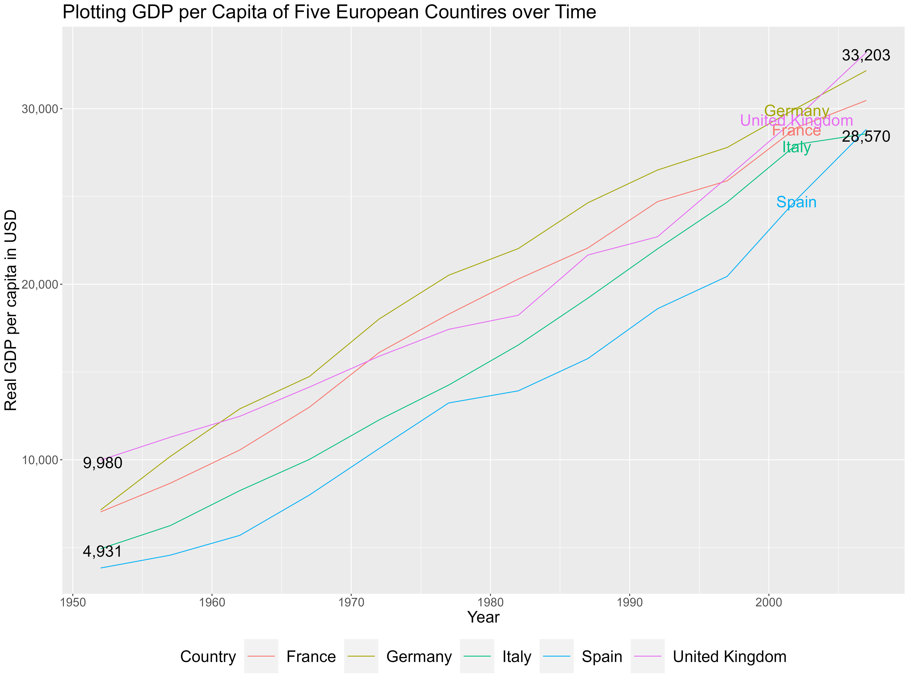

\newpage

# Introduction

This short markdown file is written to provide a simple example of an R markdown to LISER researchers. The aim of this document to cover all the essential cases that could be used in R markdown. Again, the gapminder data set from the *gapminder* package will be used. You can check the gapminder website by clicking this [link](https://www.gapminder.org/).

# Code chunk in R markdown

## Creating a code chunk

To create an R code chunk, type 3 backticks(\`), curley brackets({}), and 'r' inside those brackets. Backtick is a symbol located next to 1 for a *QWERTY* keyboard. Then close the code chunk by typing 3 backticks again. For instance,

```{r, reading-data}
#declaring libraries
packages <- c("dplyr", "gapminder", "ggplot2")
lapply(packages, require, character.only = T)
print("Packages are loaded!")
```

I have set the name of the code chunk as "reading-data". If an error occurs in this code chunk, the console will produce an error message saying that an error occurred in the "reading-data" code chunk.

## Not including the codelines of a code chunk

Actually, there is no reason to show the code lines calling the packages. It is more aesthetically appealing to write which packages were used and not to show the code lines. Let's try not to include those code lines in our document.

```{r, no-echo, echo=F}
#declaring libraries
packages <- c("dplyr", "gapminder", "ggplot2")
lapply(packages, require, character.only = T)
print("Packages are loaded!")
```

Now the document does not show any code line.

## Not including the output of the codes

For this case, the output of the code lines, printing packages are loaded or TRUE values from lapply function, does not have to be shown in the document. On the contrary, it is aesthetically better to remove them.

```{r, no-include, include=F}
#declaring libraries
packages <- c("dplyr", "gapminder", "ggplot2")
lapply(packages, require, character.only = T)
print("Packages are loaded!")
```

As you can see, the code chunk & output have disappeared magically.

## Not running the code chunk

On the other hand, sometimes, you simply want to show the code lines but not want them to run. Let's see how this could be done.

```{r, no-run, eval=F}
# I simply want to show this code chunk
"for no reason I just feel like it"
print(data == bad)
```

***Voilà!***

# Text format

## Bold text

To make a text bold simply type asterisk(\*) two times when you would like to start and another two asterisks at the end. For instance, if you want to make Luxembourg Institute of Socio-Economic Research bold, **Luxembourg Institute of Socio-Economic Research**.

## Italic text

Italic is almost same as bold text but typing asterisk only one time. Let's add LISER right next to our bold text in parentheses.

**Luxembourg Institute of Socio-Economic Research**(*LISER*)

## Bullet points

If you want to make a list of somethings and put a bullet point in front of them, simply use a hyphon(-) in front of them.

To list three major research departments of LISER:

**Luxembourg Institute of Socio-Economic Research**(*LISER*)

-   Labor Market(LM)
-   Urban Development and Mobility(UDM)
-   Living Conditions(LC)

## Ordered list

If you want to put numbers instead of bullet points, simply use the number and a full stop(.). Of course you can combine both types. For instance,

**Luxembourg Institute of Socio-Economic Research**(*LISER*)

1.  Labor Market(LM)
2.  Urban Development and Mobility(UDM)
    -   ACROSS
3.  Living Conditions(LC)

## Mathematical expressions

The way to write mathematical expressions in R Markdown is identical to Latex.

$Y = C + I + G + NX$

To add an aligning option,

$$
\begin{aligned}
Y = C + I + G + NX
\end{aligned}
$$

## adding a hyperlink

Sometimes you want to add a hyperlink to certain words. Let's add a hyperlink to LISER in the next line.

[LISER](https://www.liser.lu/)

## adding a footnote

Adding a footnote is much similar to adding a hyperlink. I will try to add a footnote in the next line.

Luxembourg has three official languages^[The three languages are Luxembourgish, French, and German.].

# Real Example

## Setting the working directory

In case your primary data file is not stored in the same path as your project, it easier to set the working directory to where the data is located. For instance,

```{r, setup, eval=F}
knitr::opts_knit$set(root.dir = "C:/Users/Jongoh/Dropbox/training/dplyr")
```

After this, you can read data files that are located in "C:\\Users\\Jongoh\\Dropbox\\training\\dplyr\\data" by simply typing *fread("data\\data_file.csv")*.

## Calling packages

```{r, set-packages, echo=T}
#declaring libraries
packages <- c("knitr", "dplyr", "gapminder", "ggplot2")
lapply(packages, require, character.only = T)
```

## Reading in data

```{r, read-data}
#reading the gapminder data
data <- gapminder
```

## Simple summary statistics

```{r, sum-stat}
print(str(data))
print(summary(data$continent))
print(summary(data$lifeExp))
```

## Simple summary table

Creating a simple summary table for life expectancy by continent!

```{r, create-sum-table}
#creating a simple summary table for life expectancy by continent!
sum.df <- data %>%
  group_by(continent) %>%
  summarise( Life_Min = min(lifeExp),
             Life_Average = mean(lifeExp),
             Life_Median = median(lifeExp),
             Life_Max = max(lifeExp),
             Count =n())
sum.df
```

Let's put in the document neatly!

```{r, show-table}
#showing the table neatly
kable(sum.df, caption = "Simple Summary Table of Life Expectancy by Continent")
```

## Declare variables and use them in a document

One of the most annoying thing to do when one is writing a paper or a report is when a number has changed and you have to go through the whole document to change the numbers. This is avoidable in R Markdown and I will show you how.

Let's calculate the number of countries by continent.

```{r, count-country, warning=F, error=F}
count_country.df <- data %>%
  group_by(continent, year) %>%
  summarize(Count = n(), 
            .groups = "keep") %>% #keeping the grouped variables
  ungroup() %>%
  select(-year) %>%
  unique()
count_country.df
```

Now let's assign the values to each variable.

```{r, assign-numbers}
africa_num <- count_country.df %>% filter(continent=="Africa") %>% select(Count) %>% unlist()
america_num <- count_country.df %>% filter(continent=="Americas") %>% select(Count) %>% unlist()
asia_num <- count_country.df %>% filter(continent=="Asia") %>% select(Count) %>% unlist()
europe_num <- count_country.df %>% filter(continent=="Europe") %>% select(Count) %>% unlist()
oceania_num <- count_country.df %>% filter(continent=="Oceania") %>% select(Count) %>% unlist()
```

Then you can easily use them in the text.

For instance,

|    ***After counting the number of countries in each continent, Africa has `r africa_num` countries, Americas `r america_num`, Asia `r asia_num`, Europe `r europe_num`, and Oceania `r oceania_num`.***

Amazing right? Let's assume that we obtained additional observation from a beautiful island Fiji. If this was a word document, I should go through the whole document to find where I mentioned the number of Oceaninan countries.

In R Markdown, if the dataset was updated, you don't have to change anything. I will show you.

I will manually update the *data* variable as a showcase.

```{r, include-fiji}
#first changing the factor variable to character
data$country <- as.character(data$country)
#adding a row
data <- rbind(data, list(country = rep("Fiji", length(unique(data$year))), 
                   continent = rep("Oceania", length(unique(data$year))), 
                   year = unique(data$year),
                   lifeExp = rep(999, length(unique(data$year))), 
                   pop=rep(999, length(unique(data$year))), 
                   gdpPercap = rep(999, length(unique(data$year)))
                   )
              )
#changing to factor again
data$country <- as.factor(data$country)
print(data %>% filter(continent == "Oceania") %>% select(country) %>% unique())
```

Now, let's write the same line after declaring the numbers again.

```{r, assign-numbers2, warning=F, error=F}
#the data frame again
count_country.df <- data %>%
  group_by(continent, year) %>%
  summarize(Count = n(),
            .groups = "keep") %>%
  ungroup() %>%
  select(-year) %>%
  unique()

#numbers
africa_num <- count_country.df %>% filter(continent=="Africa") %>% select(Count) %>% unlist()
america_num <- count_country.df %>% filter(continent=="Americas") %>% select(Count) %>% unlist()
asia_num <- count_country.df %>% filter(continent=="Asia") %>% select(Count) %>% unlist()
europe_num <- count_country.df %>% filter(continent=="Europe") %>% select(Count) %>% unlist()
oceania_num <- count_country.df %>% 
  filter(continent=="Oceania") %>% 
  select(Count) %>% 
  unlist()
```

|    ***After counting the number of countries in each continent, Africa has `r africa_num` countries, Americas `r america_num`, Asia `r asia_num`, Europe `r europe_num`, and Oceania `r oceania_num`.***

## putting nice graphs

Let's use the graph we produced in the ggplot section.

```{r, input-graph, fig.align='center', out.width='60%', out.height='60%', fig.cap= "Pretty Graph"}

```

# Concluding

That's all for this R Markdown example file. I hope this file was clear for you and if you have any questions, don't hesitate to contact me. jongoh.kim@liser.lu